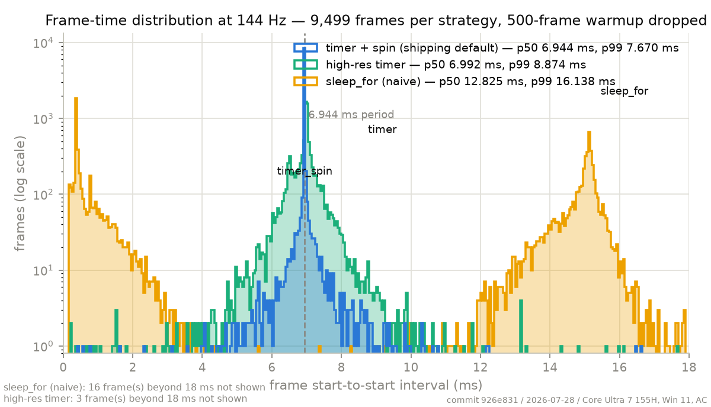
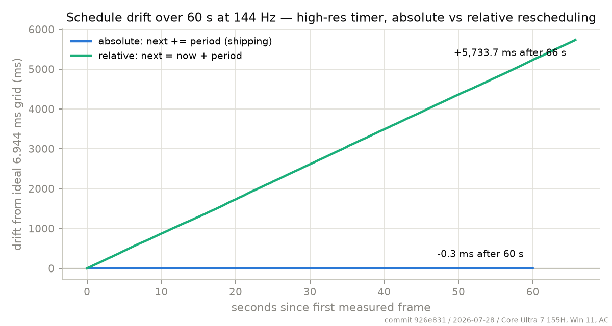

# OpenGL-Renderer

A C++20 threaded OpenGL renderer whose real subject is three systems problems:
thread-affine graphics contexts, a lock-free input handoff, and precise frame
pacing on general-purpose OSes. The rotating cube is the demo, not the point.

*Start-to-start frame intervals at 144 Hz (9,500 measured frames per strategy,
log count axis). The shipping `timer_spin` pacer puts essentially every frame
in one 50 µs bin at the 6.944 ms period. A bare high-res timer holds the
schedule on average but hands its OS wake jitter straight to the frame times
(p99 8.874 ms). Naive `sleep_for` never delivers a frame near the period: on
this machine its ~7 ms sleep requests wake on the ~15.6 ms scheduler tick, so
it alternates ~16 ms frames with immediate post-miss frames — the two
clusters. (That same mechanism is what produces the classic comb at 15.6 ms
multiples on stock Windows.)*

*Why the pacer schedules `next += period` and never `now + period`: identical
runs (high-res timer, 144 Hz, 8,640 measured frames), only the rescheduling
rule differs. The absolute schedule ends 0.3 ms from ideal after 60 seconds;
the relative one leaks every frame's work time and wake latency into the
schedule permanently — about 0.66 ms per frame, 5.7 s behind after a minute,
while reporting zero missed deadlines the whole way.*

Regenerate both: `python bench/run_plots.py` (~7 minutes of measured runs; AC
power, machine otherwise idle), which chains into `bench/plot_frames.py` — the
only script here that needs `pip install matplotlib`.

## Build & run

    cmake -B build
    cmake --build build --config Release
    build/Release/cube.exe [--input=mutex|bitmask|seqlock] [--fps N] [--poll-hz N] [--log PATH]   # build/cube on Linux
    ctest --test-dir build -C Release --output-on-failure

Arrow keys rotate the cube, SPACE pauses the spin, ESC exits.

## Input handoff backends (`--input=`, default `mutex`)

The main thread polls input at ~1 kHz and publishes a snapshot; the render
thread consumes it once per frame. Three interchangeable backends sit behind
one interface (`src/input_state.h`):

| flag      | mechanism                                                        | carries                              |
|-----------|------------------------------------------------------------------|--------------------------------------|
| `mutex`   | `std::mutex` around a small POD — the baseline                   | keys + mouse delta + `publish_ns`    |
| `bitmask` | `std::atomic<uint32_t>`, one bit per key; writer `fetch_or`/`fetch_and` (release), reader one acquire load per frame | keys only |
| `seqlock` | sequence counter; writer never blocks, reader retries on odd/changed sequence | keys + mouse delta + `publish_ns` |

The payload carries a `uint64_t publish_ns` timestamp so end-to-end input
latency (consume time − publish time) can be measured. That field is why the
bitmask alone is not the final answer: it is genuinely lock-free with no torn
reads and no ABA, but 32 bits cannot carry a timestamp.

### The seqlock's data race, named

The seqlock reader copies the payload without synchronization while the writer
may be mid-store. Under the C++ memory model that is formally a data race —
undefined behavior. The sequence-number retry discards every torn copy on real
hardware, the fences around the copy are the standard practical construction
(Boehm, *Can seqlocks get along with programming language memory models?*),
and every shipping engine contains something shaped like this. It works on
every real CPU; it is still bending a rule of the abstract machine. Naming the
rule being bent is the signal — pretending there isn't one would be the bug.

## Frame pacing (`--fps N`, default uncapped)

The pacer sleeps to an **absolute** deadline: `next += period`, never
`now + period`. With relative deadlines, one slow frame permanently shifts
every frame after it; with absolute ones, a hiccup is local. A missed
deadline is counted and the schedule re-anchored at the current time —
the debt is dropped, never repaid with a burst of short frames.
`--resched=relative` exists solely to measure the classic bug the absolute
rule prevents — it is what produces the runaway line in the drift figure
above.

Each platform gets its sharpest timer: `CreateWaitableTimerExW` with
`CREATE_WAITABLE_TIMER_HIGH_RESOLUTION` on Windows (pre-1803 falls back to
the legacy timer plus `timeBeginPeriod(1)` — which raises the timer
interrupt rate for the entire machine, and the code says so),
`clock_nanosleep(CLOCK_MONOTONIC, TIMER_ABSTIME)` retried on `EINTR` on
Linux, and `mach_wait_until` on macOS (where real precision also wants
`THREAD_TIME_CONSTRAINT_POLICY`).

### Why the spin loop is not optional

No OS sleep wakes you *at* a time; it wakes you *at or after* it, by a
scheduler-dependent overshoot that ranges from tens of microseconds to
milliseconds depending on machine, power plan, and load. Sleeping all the
way to the deadline therefore hands that jitter directly to the frame
time. So the pacer sleeps *short* of the deadline by a margin and spins
the remainder on the monotonic clock, converting unbounded OS wake jitter
into a bounded busy-wait. The margin is not a constant — a value tuned on
one machine is wrong on another — so it is estimated online from the
measured overshoot of every sleep (Welford's mean and variance,
margin = mean + 3σ, clamped to half the period).

## Instrumentation (`--log PATH`, requires `--fps`)

Each paced run can write one CSV of per-frame records:

    frame,frame_start_ns,frame_end_ns,frame_time_ns,sleep_requested_ns,sleep_actual_ns,input_latency_ns,missed

- `frame_time_ns` is **deadline to deadline** — the frame cadence the pacer
  actually delivered, not how long the work took. Frame 0 logs 0.
- `input_latency_ns` is consume time minus the payload's `publish_ns`, both
  on the same monotonic clock. The bitmask backend logs 0 here: 32 bits
  cannot carry a timestamp, which is precisely why it was never the final
  answer among the input backends.
- The log buffer is preallocated before the first frame and the file is
  written once, on exit. No file IO — and no reallocation — ever happens
  inside a frame being timed; if the buffer fills, records are dropped and
  counted instead.
- Instrumented frames run a fixed synthetic CPU workload so the numbers
  characterize the pacer, not GPU or driver variance.

All timestamps come from `pacer_now_ns()` — one timeline for deadlines,
sleeps, publishes, and consumes.

## Benchmarks (`--pace=`, `--bench-frames N`)

The pacing-strategy matrix prices four ways of hitting a frame deadline —
`--pace=sleep|timer|timer_spin|spin` (default `timer_spin`, requires `--fps`)
— at 60/144/240 Hz plus an uncapped baseline. To reproduce:

    python bench/run_matrix.py    # ~19 minutes; run on AC power with the machine otherwise idle

Each of the 13 cells runs `cube.exe --bench-frames=10000` (self-terminating
bench mode; the first 500 frames are warmup and are discarded, n=9500) and the
runner invokes `bench/summarize.py` (both scripts are stdlib-only Python).
Raw per-frame CSVs land in `bench/results/raw/<timestamp>/`, which is
git-ignored; only the summarized results are committed:
[bench/results/2026-07-27-pacing-matrix.md](bench/results/2026-07-27-pacing-matrix.md)
(with full provenance and machine notes) and the matching
`2026-07-27-summary.csv`.

Column definitions: `p50/p95/p99/max/stddev` are computed over each cell's
per-frame `frame_time_ns` (deadline-to-deadline for paced cells,
start-to-start for uncapped) after dropping warmup; `missed` is the count of
frames whose deadline had already passed at wait time (the schedule resyncs,
never chases); `cpu %` is render-thread CPU time over the measured window
(warmup boundary → loop exit), read via `QueryThreadCycleTime` calibrated
against the pacer's QPC clock on Windows and `CLOCK_THREAD_CPUTIME_ID` on
POSIX, divided by wall time.

Findings, with the CPU column as the price tag: naive `sleep_for` is cheap
(~3–6% CPU) but cannot hold 144 or 240 Hz on Windows — it missed half of all
deadlines at both rates. A high-resolution absolute timer alone holds every
rate at similar cost (~3–9%), but only because the deadline-to-deadline metric
forgives its wake jitter; that jitter (tens of µs to ms) lands directly in
frame start times. `timer_spin`, the shipping default, buys clock-read-accurate
deadlines for a measured margin of spinning (~8–16% CPU, scaling with rate).
Pure `spin` is marginally better still — zero misses everywhere — and costs an
entire core (~99%). The default is the middle of that trade, and the margin it
spins is measured per machine, not assumed.

## Input-handoff benchmark (`--poll-hz N`)

The input poll loop is paced by its own `FramePacer` — `--poll-hz N`
(1..10000, default 1000) sets the publish rate, and every run prints a
parseable `handoff:` exit line with publishes, achieved rate, missed
deadlines, and reader retries. The benchmark prices the three handoff
backends three ways. To reproduce:

    python bench/run_handoff.py   # ~10 minutes; AC power, machine otherwise idle

That runs `handoff_bench` (uncontended per-op costs plus a contended sweep),
then six app cells (`--input=mutex|bitmask|seqlock` × `--poll-hz=1000|10000`,
10,000 frames each at 144 Hz), and summarizes via
`bench/summarize_handoff.py`. Committed results:
[bench/results/2026-07-27-handoff.md](bench/results/2026-07-27-handoff.md)
and the matching `2026-07-27-handoff-summary.csv`.

Three tables, three meanings. **Table A** (uncontended cost) is batched
per-op throughput — 1 M-iteration timed loops whose iterations overlap in
the pipeline, so the numbers are amortized cost for comparing backends, not
single-call latency. **Table B** (in-app) reports end-to-end input latency
and reader retries at real app rates; its latency percentiles measure
**sampling cadence, not backend cost** — publish gap plus consumer phase
dominate at microsecond-scale op costs, so those columns characterize the
poll pacing (judge them against each cell's *achieved* rate, printed below
the table). **Table C** (contended sweep) is where backend differences are
real: a tight-loop reader against a paced publisher swept from 1 kHz to
unthrottled.

The honest result: an uncontended `std::mutex` round-trip costs ~16.6 ns to
publish and ~15.9 ns to read here. At this app's real rates — 1,000
publishes/s against 144 reads/s — the writer holds the lock ~16,600 ns of
every second (a 1.7 × 10⁻⁵ fraction), so the expected number of reads that
ever meet a held lock is ≈ 144 × 1.7 × 10⁻⁵ ≈ 0.002 per second — about one
contended read every seven minutes. The measured zeros agree: five of six
app cells logged exactly zero reader retries. I built the lock-free backends
anyway and measured where that stops being true: the mutex reader's p99
stays indistinguishable from the seqlock's (within one 100 ns clock quantum)
until ≈ 100,000 publishes/s, first measurably departing there (300 ns vs
100 ns) and decisively by 1 M/s (1,300 ns vs 200 ns). Below that, choosing
the seqlock is a design statement, not a performance win.
